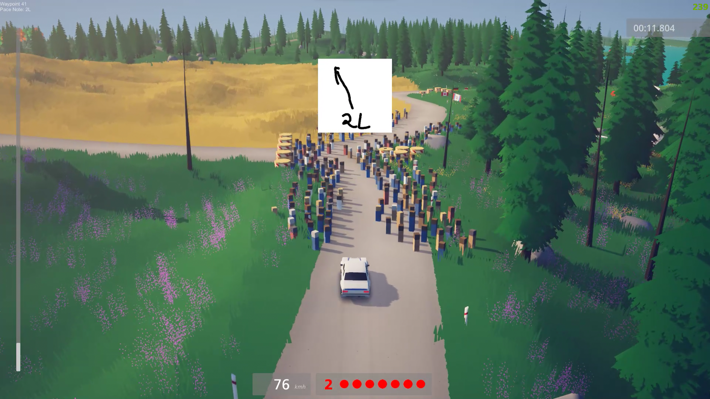

# Art Of Rally Splits

[](https://github.com/Theaninova/ArtOfRallySplits/releases/latest)

[](https://discord.gg/Sx3e7qGTh9)

A mod for Art of Rally that displays customizable splits.

#### Launcher Support


#### Platform Support


***If you created splits and want to share them,
please either message me or submit a merge request to the `presets/` folder.***

## Usage

Press `CTRL + F10` to bring up the mod menu. Click on the Splits mod,
and enable or disable the desired features.

### Features

### Folder Structure

```
mod root/
├─ split_configs/
│  ├─ myth/
│  │  ├─ finland_noormarkku.csv
│  │  └─ ...
│  └─ [your_name]/
│     ├─ finland_noormarkku.csv
│     └─ ...
├─ ArtOfRallySplits.dll
└─ info.json

```

### Writing Splits

Writing splits is very easy.

To get started, copy all the files in the `/template` folder to
`/split_configs/[your_name]`.

The contents should be relatively self-explanatory.

To switch the splits sets you unfortunately need to edit the `Settings.xml`
(created on the first mod start), because the mod manager doesn't support
string settings.

Change the `<ConfigSet>myth</ConfigSet>` to `<ConfigSet>[your_name]</ConfigSet>`.

Then enable the `ShowCurrentWaypoint` option in the mod's menu.
A new info box will appear on the top left of the screen with various
helpful data, most importantly the current waypoint index.

Splits are just csv, comma separated value files. To add a split, simply
enter the waypoint index you want it to be at.

* ***DO NOT*** add additional spaces
* ***DO NOT*** add linebreaks
* ***DO NOT*** add a trailing comma

An example file might look like this:

`split_configs/theaninova/germany/hockweiler_r.csv`
```
40,84,125,175
```

And that's it! Simply reload the map and the new splits will be applied!

## Installation

Follow the [installation guide](https://www.nexusmods.com/site/mods/21/) of
the Unity Mod Manager.

Then simply download the [latest release](https://github.com/Theaninova/ArtOfRallySplits/releases/latest)
and drop it into the mod manager's mods page.

## Showcase

[**Demo Video:**](https://www.youtube.com/watch?v=2-Leem4fPRk)

[](https://www.youtube.com/watch?v=2-Leem4fPRk)
